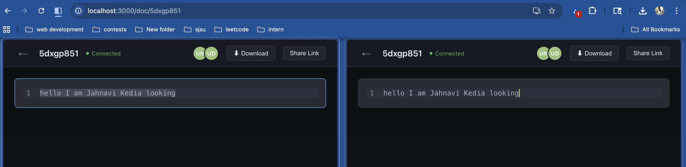

# CollabEdit

A real-time collaborative text editor built from scratch, featuring a custom CRDT (Conflict-free Replicated Data Type) engine for conflict resolution, WebSocket-based synchronization, and live cursor tracking.



## Features

- **Real-time collaboration** — Multiple users edit the same document simultaneously with instant synchronization
- **CRDT-based conflict resolution** — Custom implementation ensures all clients converge to the same state, even with concurrent edits
- **Live cursor tracking** — See where other users are typing with colored cursor indicators and name labels
- **Presence awareness** — See who's currently connected to a document with colored avatar indicators
- **Shareable URLs** — Each document gets a unique URL for easy sharing
- **Persistent storage** — Documents survive server restarts with periodic database snapshots
- **Dark theme UI** — Clean, modern interface inspired by GitHub's design

## Architecture

```
┌──────────────┐     WebSocket (STOMP)      ┌──────────────────┐
│   Browser A   │◄─────────────────────────►│                  │
│  React + CM6  │   /topic/document/{id}    │   Spring Boot    │
└──────────────┘   /topic/presence/{id}     │                  │
                   /topic/cursor/{id}       │  ┌────────────┐  │
┌──────────────┐                            │  │ CRDT Engine│  │
│   Browser B   │◄─────────────────────────►│  └────────────┘  │
│  React + CM6  │                           │  ┌────────────┐  │
└──────────────┘        REST API            │  │  H2 (file) │  │
                   GET /api/documents/{id}  │  └────────────┘  │
┌──────────────┐                            │  ┌────────────┐  │
│   Browser C   │◄─────────────────────────►│  │  Session    │  │
│  React + CM6  │                           │  │  Manager    │  │
└──────────────┘                            └──────────────────┘
```

### How the CRDT Works

The editor uses a sequence CRDT based on the RGA (Replicated Growable Array) algorithm. Each character has a globally unique ID composed of a Lamport timestamp and site identifier. When two users type at the same position simultaneously, the CRDT's deterministic ordering rules guarantee that all clients converge to the same result — no central coordinator needed.

**Key properties:**
- Every character has a unique ID: `{siteId}-{clock}`
- Characters reference their parent (the character they were inserted after)
- Conflicts are resolved deterministically using clock values and site IDs
- Deletes are handled via tombstoning — characters are marked invisible, not removed
- Lamport timestamps ensure causal ordering across all clients

### Sync Flow

1. **New user joins** → Fetches full document state via REST, loads it directly into the local CRDT
2. **User types** → Local CRDT generates an operation → sent to server via WebSocket → server applies and broadcasts to all subscribers
3. **Remote operation arrives** → Applied to local CRDT → CodeMirror editor updated to match
4. **User disconnects** → Server detects WebSocket close event → removes from presence → broadcasts updated user list

### Persistence Strategy

Documents are saved to an H2 file-based database every 30 seconds (only if modified). This provides a 1,500x reduction in database writes compared to per-keystroke persistence, with an acceptable 30-second data loss window on crash. The full CRDT sequence is serialized as JSON and stored in a TEXT column, matching the access pattern of always loading/saving the complete document.

## Tech Stack

| Layer | Technology |
|-------|-----------|
| Frontend | React 18, TypeScript, CodeMirror 6 |
| Real-time | WebSocket with STOMP protocol, SockJS fallback |
| Backend | Spring Boot 3, Java |
| CRDT | Custom RGA implementation (both Java and TypeScript) |
| Database | H2 (file-based) with JPA/Hibernate |
| Styling | Custom CSS with GitHub-dark theme |

## Getting Started

### Prerequisites

- Java 17+
- Node.js 18+
- npm or yarn

### Backend

```bash
cd backend
./mvnw spring-boot:run
```

The server starts at `http://localhost:8080`.

### Frontend

```bash
cd frontend
npm install
npm start
```

The app opens at `http://localhost:3000`.

### Usage

1. Open `http://localhost:3000` and click **New Document**
2. Copy the URL and open it in another browser tab (or send to a friend on the same network)
3. Start typing — edits sync in real-time across all connected tabs

## Project Structure

```
├── backend/
│   └── src/main/java/com/collabeditor/backend/
│       ├── model/
│       │   ├── CrdtChar.java          # Character with unique ID, parent ref, tombstone
│       │   ├── CrdtDocument.java       # Server-side CRDT sequence with insert/delete
│       │   ├── CrdtOperation.java      # Operation envelope (INSERT/DELETE)
│       │   └── DocumentEntity.java     # JPA entity for persistence
│       ├── service/
│       │   ├── DocumentService.java    # Document lifecycle, periodic saves
│       │   └── SessionManager.java     # Tracks connected users per document
│       ├── controller/
│       │   ├── DocumentController.java     # WebSocket message handlers
│       │   └── DocumentRestController.java # REST API for state loading
│       ├── config/
│       │   └── WebSocketConfig.java    # STOMP/SockJS configuration
│       └── handler/
│           └── WebSocketEventHandler.java  # Disconnect detection
│
├── frontend/
│   └── src/
│       ├── components/
│       │   ├── Editor.tsx              # CodeMirror 6 with CRDT integration
│       │   └── PresenceBar.tsx         # User avatar indicators
│       ├── pages/
│       │   ├── HomePage.tsx            # Landing page
│       │   └── DocumentPage.tsx        # Document view with WebSocket connection
│       ├── utils/
│       │   └── crdt.ts                 # Client-side CRDT engine
│       └── styles/
│           └── app.css                 # Dark theme styles
```

## Design Decisions

**Why CRDT over OT (Operational Transformation)?**
CRDTs don't require a central server to resolve conflicts. Each client can independently determine the correct document state from any set of operations, making the system more resilient and easier to reason about.

**Why periodic snapshots instead of per-keystroke writes?**
A user typing at 60 WPM generates ~5 database writes per second. With periodic snapshots every 30 seconds, we reduce this to 1 write per 30 seconds — a 150x reduction per user. The trade-off is a 30-second data loss window on crash.

**Why both REST and WebSocket?**
REST is used for the initial document state load (request-response pattern). WebSocket is used for real-time operations (pub-sub pattern). This hybrid approach uses each protocol for what it does best.

**Why full-document JSON serialization?**
The access pattern is always "load entire document" or "save entire document." Normalizing characters into individual rows would add complexity without benefit — we never query individual characters.
